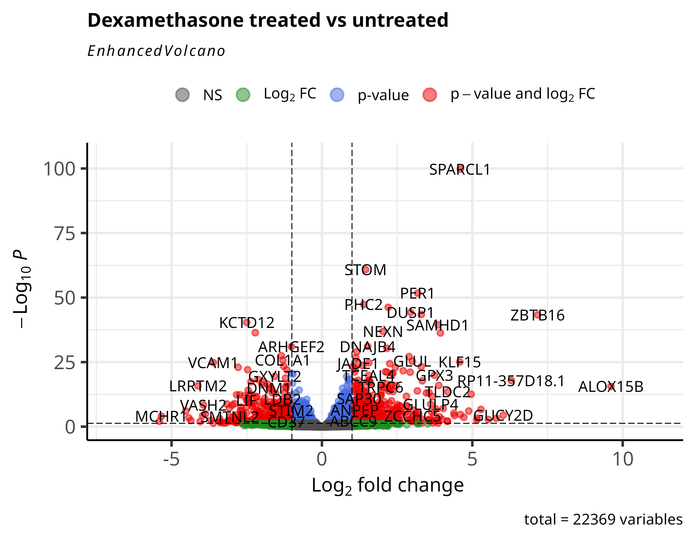
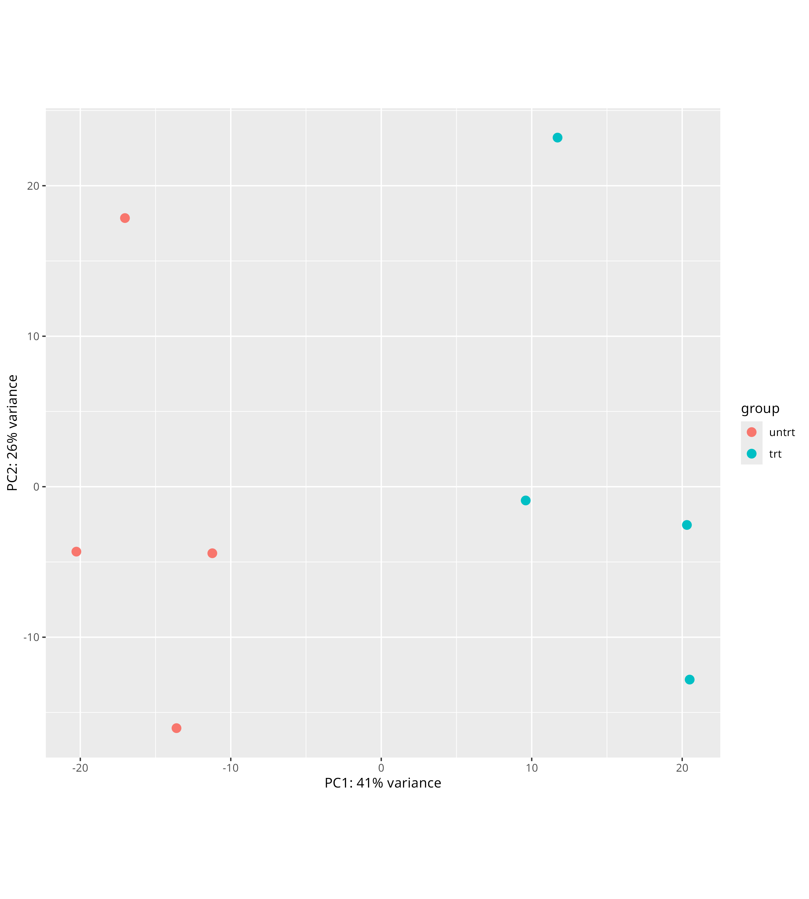
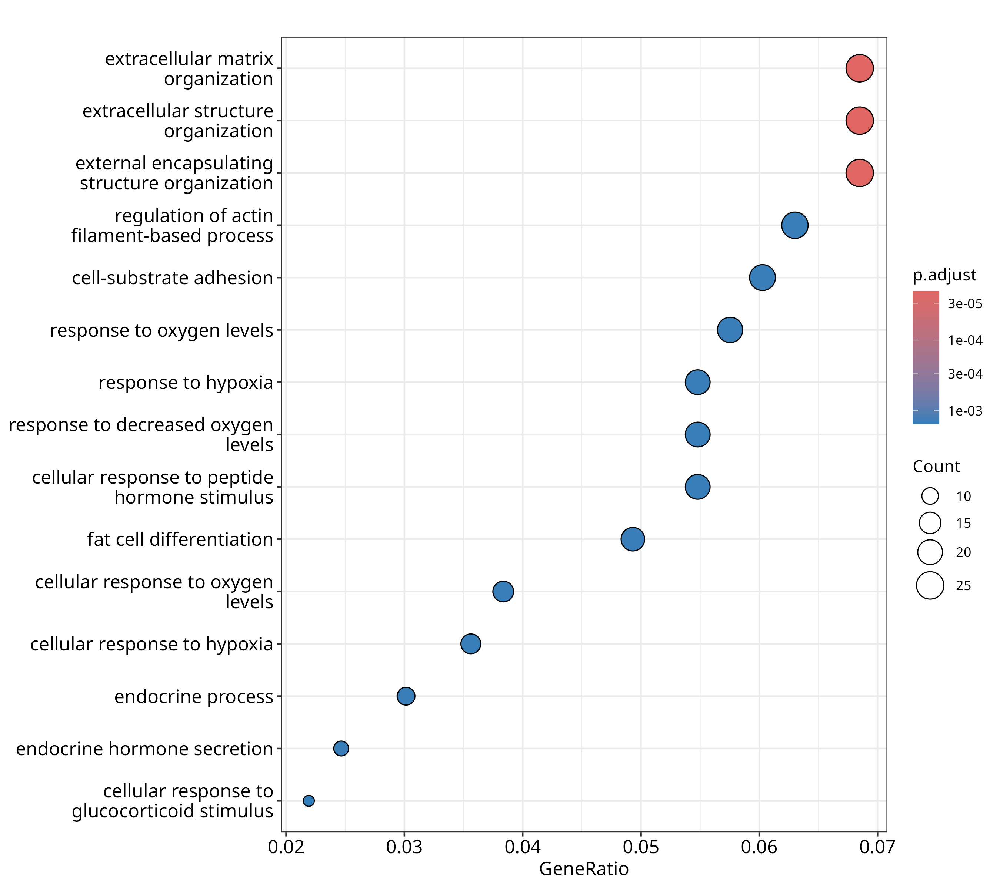
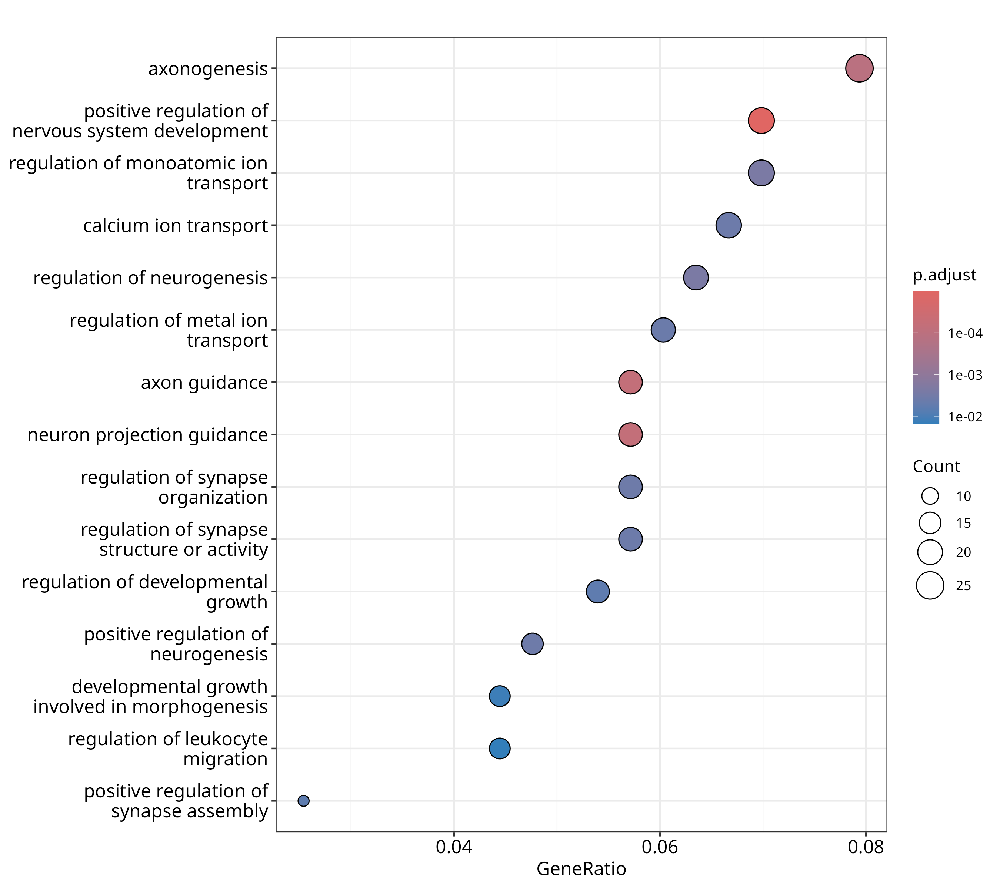

# Dexamethasone Response in Human Airway Smooth Muscle Cells — a Bulk RNA-seq Analysis

A differential expression analysis of the **airway** dataset (Himes et al.), using
**DESeq2** in R. Starting from raw gene counts, this project identifies which genes
change when human airway smooth muscle cells are treated with the steroid
**dexamethasone**, and which biological pathways those genes belong to.



---

## Background

Dexamethasone is a glucocorticoid steroid used to treat asthma by reducing airway
inflammation. To understand *how* it works at the gene level, airway smooth muscle
cells from four donors were each split into a **treated** (dexamethasone) and an
**untreated** control sample, then their RNA was sequenced. The question:

> **Which genes change expression in response to dexamethasone, and what biological
> processes do they represent?**

This is the classic bulk RNA-seq workflow: *differential expression* followed by
*pathway enrichment*.

## Data

- **Source:** the `airway` Bioconductor dataset (Himes et al. 2014), 8 samples
  (4 treated, 4 untreated), paired by donor cell line.
- **Raw dimensions:** 63,677 genes × 8 samples (raw integer counts).
- **After filtering** (genes with total counts ≥ 10): 22,369 genes tested.

## Methods

| Step | What | Tool / setting |
|---|---|---|
| Build dataset | Counts + sample table + design | `DESeqDataSet`, `design = ~ dex` |
| Reference level | Untreated set as baseline | `relevel(dds$dex, ref = "untrt")` |
| Filter | Remove near-undetected genes | `rowSums(counts(dds)) >= 10` |
| Quality check | Sample PCA (treated vs untreated separation) | `vst` + `plotPCA` |
| Differential expression | Wald test per gene | `DESeq()`, `results()` |
| Visualization | Volcano plot | `EnhancedVolcano`, cutoffs padj < 0.05, |log2FC| > 1 |
| Enrichment | GO Biological Process, up and down gene sets | `clusterProfiler::enrichGO` |

Significant genes were defined as **padj < 0.05 AND |log2FoldChange| > 1**.

## Results

### Quality control
Sample PCA shows treated and untreated samples separating along PC1 (41% of variance),
confirming a strong, consistent treatment effect.



### Differential expression
Of 22,369 genes tested:
- **475 genes significantly up-regulated** with dexamethasone (padj < 0.05, log2FC > 1)
- **397 genes significantly down-regulated** (padj < 0.05, log2FC < -1)

The volcano plot (top of page) shows the full landscape; well-known
glucocorticoid-responsive genes (e.g. *SPARCL1*, *KLF15*, *ZBTB16*) are among the
strongest up-regulated hits, while inflammation-associated genes (e.g. *VCAM1*)
are down-regulated — consistent with an anti-inflammatory steroid.

### Pathway enrichment — up-regulated genes



Top enriched GO Biological Processes among up-regulated genes (exact terms and
adjusted p-values from `enrichGO`):

| GO ID | Process | Count | p.adjust |
|---|---|---|---|
| GO:0030198 | extracellular matrix organization | 25 | 2.0e-05 |
| GO:0043062 | extracellular structure organization | 25 | 2.0e-05 |
| GO:0045229 | external encapsulating structure organization | 25 | 2.0e-05 |
| GO:0032970 | regulation of actin filament-based process | 23 | 1.4e-03 |
| GO:0001666 | response to hypoxia | 20 | 1.4e-03 |
| GO:0031589 | cell-substrate adhesion | 22 | 1.4e-03 |
| GO:0070482 | response to oxygen levels | 21 | 1.4e-03 |
| GO:0071375 | cellular response to peptide hormone stimulus | 20 | 1.5e-03 |
| GO:0071385 | **cellular response to glucocorticoid stimulus** | 8 | 1.5e-03 |

The up-regulated program centres on **extracellular matrix organization and cell
adhesion**, alongside **hypoxia/oxygen response**. Critically, the enrichment
independently recovers **"cellular response to glucocorticoid stimulus"** — the
expected on-target signature of the drug.

### Pathway enrichment — down-regulated genes



Top enriched GO Biological Processes among down-regulated genes:

| GO ID | Process | Count | p.adjust |
|---|---|---|---|
| GO:0051962 | positive regulation of nervous system development | 22 | 1.0e-05 |
| GO:0007411 | axon guidance | 18 | 6.5e-05 |
| GO:0097485 | neuron projection guidance | 18 | 6.5e-05 |
| GO:0007409 | axonogenesis | 25 | 1.1e-04 |
| GO:0043269 | regulation of monoatomic ion transport | 22 | 2.3e-03 |
| GO:0050767 | regulation of neurogenesis | 20 | 2.3e-03 |
| GO:0006816 | calcium ion transport | 21 | 3.9e-03 |
| GO:0010959 | regulation of metal ion transport | 19 | 4.1e-03 |
| GO:0002685 | regulation of leukocyte migration | 14 | 1.5e-02 |

The down-regulated set is enriched for **neuronal/axon-guidance and ion-transport**
terms. (Many of these guidance and ion-channel genes are shared with smooth muscle;
the enrichment reflects genes suppressed by treatment rather than a literally
neuronal process.)

## Files

```
airway-deseq2/
├── README.md
├── airway_analysis.R              # the full analysis script
├── .gitignore
├── figures/
│   ├── PCA_check.png
│   ├── volcano_plot.png
│   ├── pathway_enrichment_upregulated.png
│   └── pathway_enrichment_downregulated.png
└── results/
    └── deseq2_results.csv         # full DESeq2 results, all genes
```

## How to reproduce

```r
# in R, with Bioconductor packages installed:
# DESeq2, airway, EnhancedVolcano, clusterProfiler, org.Hs.eg.db, ggplot2, pheatmap
source("airway_analysis.R")
```

## Notes on analysis choices

- **Reference level** was set to untreated so log2 fold-changes read as "treated vs
  untreated" (positive = up with the drug).
- **Filtering** was deliberately gentle (total counts ≥ 10) to retain genes that are
  off in one condition but on in the other — exactly the on/off genes of interest.
- Enrichment was run **separately on up- and down-regulated genes**, since mixing
  directions obscures which biology is induced vs. suppressed.

## Tools

R, DESeq2, EnhancedVolcano, clusterProfiler, org.Hs.eg.db, ggplot2.

---

*Author: Ghashia Mukhtar · Bulk RNA-seq differential expression project · 2026*
